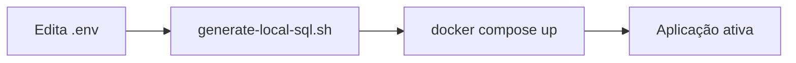
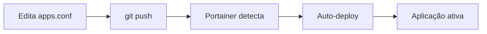

# 📊 Comparação: Local vs GitOps/Portainer

Este documento compara as duas abordagens de deployment suportadas pelo projeto.

## 🏠 Modo Local vs 🌐 Modo GitOps/Portainer

| Aspecto                  | 🏠 Local                      | 🌐 GitOps/Portainer             |
| ------------------------ | ----------------------------- | ------------------------------- |
| **Configuração de Apps** | `.env` (APPS_CONFIG)          | `config/apps.conf` (versionado) |
| **Credenciais**          | `.env` (não versionado)       | Portainer Environment Variables |
| **Deploy**               | `docker compose up -d`        | Auto-deploy via GitOps          |
| **Adição de App**        | `add-new-app.sh`              | `add-gitops-app.sh` + git push  |
| **Ideal Para**           | Desenvolvimento local, testes | Servidores dev/prod, equipes    |
| **Gestão**               | Manual, via CLI               | Interface web Portainer         |
| **Versionamento**        | Só estrutura                  | Configurações + estrutura       |
| **Segurança**            | Básica (env vars)             | Secrets + env vars              |
| **Automação**            | Scripts manuais               | GitOps automático               |

## 🔄 Fluxos de Trabalho

### 🏠 Fluxo Local



### 🌐 Fluxo GitOps



## 🎯 Quando Usar Cada Modo

### 🏠 **Use Modo Local quando:**

- ✅ Desenvolvimento individual
- ✅ Testes rápidos e experimentação
- ✅ Ambiente totalmente controlado
- ✅ Não precisa de versionamento de configuração
- ✅ Deploy manual é aceitável

### 🌐 **Use Modo GitOps quando:**

- ✅ Equipes de desenvolvimento
- ✅ Ambientes de dev/homolog/prod
- ✅ Precisa de auditoria de mudanças
- ✅ Deploy automatizado é necessário
- ✅ Gestão centralizada via Portainer
- ✅ Múltiplos ambientes/servidores

## 📁 Estrutura de Arquivos

### 🏠 Modo Local

```
├── .env                    # Configurações + senhas (não versionado)
├── .env.example           # Template
├── docker-compose.yml     # Compose principal
└── scripts/
    ├── add-new-app.sh     # Adiciona app + senha
    └── generate-local-sql.sh         # Gera SQLs
```

### 🌐 Modo GitOps

```
├── config/
│   └── apps.conf          # Configurações (versionado)
├── .env.portainer.example # Template para Portainer
├── docker-compose.gitops.yml # Compose GitOps
├── PORTAINER.md           # Guia GitOps
└── scripts/
    ├── add-gitops-app.sh  # Adiciona app (sem senha)
    └── generate-gitops-sql.sh # Gera SQLs GitOps
```

## 🔄 Migração Local → GitOps

Se você tem um ambiente local e quer migrar para GitOps:

### 1. **Extrair configurações do .env:**

```bash
# Se seu .env tem:
APPS_CONFIG=app1:db1:user1:pass1,app2:db2:user2:pass2

# Crie config/apps.conf com:
app1:db1:user1
app2:db2:user2
```

### 2. **Preparar senhas para Portainer:**

```env
# No Portainer Environment Variables:
APP1_PASSWORD=pass1
APP2_PASSWORD=pass2
```

### 3. **Testar localmente:**

```bash
# Configure as senhas como env vars locais
export APP1_PASSWORD=pass1
export APP2_PASSWORD=pass2

# Teste o modo GitOps
bash scripts/generate-gitops-sql.sh
docker compose -f docker-compose.gitops.yml up -d
```

### 4. **Deploy no Portainer:**

- Criar stack GitOps
- Configurar environment variables
- Deploy automático

## 🏆 Recomendações

### Para **Desenvolvedor Individual:**

```bash
# Setup simples e rápido
cp .env.example .env
# Edite o .env conforme necessário
bash scripts/generate-local-sql.sh
docker compose up -d
```

### Para **Equipe/Produção:**

```bash
# 1. Configure aplicações no repositório
bash scripts/add-gitops-app.sh payment payment_db payment_user
git add . && git commit -m "feat: adiciona app payment"
git push

# 2. Configure senhas no Portainer
# Environment Variables → PAYMENT_PASSWORD=senha_segura

# 3. Deploy automático via GitOps 🚀
```

---

**Conclusão:** Ambos os modos são válidos e atendem necessidades diferentes. A escolha depende do seu contexto de uso e requisitos de automação.
