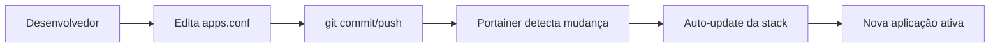

# 🐳 GitOps/Portainer Setup - ANPD Docker PostgreSQL

Este guia explica como usar este projeto com Portainer usando GitOps, mantendo as configurações no repositório e apenas as credenciais no Portainer.

## 🎯 Vantagens da Abordagem GitOps

### ✅ **O que fica versionado (repositório):**

- Configurações de aplicações (`config/apps.conf`)
- Scripts de inicialização
- Templates de configuração
- Estrutura da infraestrutura
- Documentação

### 🔐 **O que fica no Portainer:**

- Senhas das aplicações
- Credenciais do PostgreSQL e pgAdmin
- Configurações específicas do ambiente

## 🚀 Setup no Portainer

### 1. **Criar Stack GitOps**

No Portainer, crie uma nova Stack com:

**Repository Settings:**

```
Repository URL: https://github.com/anpdgovbr/docker-infra-pg
Authentication: [Se repositório privado]
Reference: refs/heads/main
Compose path: docker-compose.gitops.yml
```

**GitOps Updates:**

```
✅ Enable GitOps updates
🔄 Polling interval: 5m
```

### 2. **Configurar Environment Variables**

Na aba "Environment variables" da Stack, adicione:

```env
# PostgreSQL Principal
POSTGRES_USER=admin
POSTGRES_PASSWORD=senha_super_secreta
POSTGRES_DB=postgres

# pgAdmin
PGADMIN_DEFAULT_EMAIL=admin@anpd.gov.br
PGADMIN_DEFAULT_PASSWORD=senha_pgadmin

# Senhas das Aplicações (baseado em config/apps.conf)
BACKLOG_PASSWORD=senha_backlog_123
PORTAL_PASSWORD=senha_portal_456
API_PASSWORD=senha_api_789
RELATORIO_PASSWORD=senha_relatorio_abc
DASHBOARD_PASSWORD=senha_dashboard_def
```

### 3. **Deploy da Stack**

Clique em "Deploy the stack" e aguarde:

- ✅ Pull das imagens
- ✅ Criação dos volumes
- ✅ Execução dos init scripts
- ✅ Configuração automática do pgAdmin

## 📱 Gestão de Aplicações

### ➕ **Adicionar Nova Aplicação**

#### Via Script (Recomendado):

```bash
# No seu ambiente de desenvolvimento
git clone https://github.com/anpdgovbr/docker-infra-pg
cd docker-infra-pg

# Adiciona nova aplicação
bash scripts/add-gitops-app.sh nova_app nova_app_dev nova_user

# Commit e push
git add config/apps.conf
git commit -m "feat: adiciona aplicação nova_app"
git push origin main
```

#### Manualmente:

1. Edite `config/apps.conf` adicionando:

   ```
   nova_app:nova_app_dev:nova_user
   ```

2. Commit e push da mudança

#### No Portainer:

1. Vá na Stack → Environment variables
2. Adicione: `NOVA_APP_PASSWORD=senha_segura`
3. Update da stack (ou aguarde auto-update)

### 🗑️ **Remover Aplicação**

1. Remova a linha do `config/apps.conf`
2. Commit e push
3. No Portainer, remova a variável de senha correspondente
4. Update da stack

## 🔄 Workflow GitOps Completo

### 📝 **Desenvolvimento → Produção**



### 🔧 **Fluxos Principais**

**Adição de aplicação:**

```bash
# 1. Local: Adiciona configuração
bash scripts/add-gitops-app.sh payment payment_db payment_user

# 2. Git: Versiona mudança
git add . && git commit -m "feat: adiciona app payment"
git push

# 3. Portainer: Adiciona senha
# Environment Variables → PAYMENT_PASSWORD=senha123

# 4. Automático: Deploy acontece via GitOps
```

**Mudança de configuração:**

```bash
# 1. Edita qualquer arquivo no repo
# 2. git push
# 3. Portainer auto-atualiza (5min max)
```

## 🔍 Monitoramento e Debug

### 📊 **Status da Stack**

No Portainer:

- **Containers**: Todos devem estar "running"
- **Logs**: Verificar logs de cada container
- **Volumes**: Verificar persistência dos dados

### 🐛 **Troubleshooting**

**Stack não atualiza automaticamente:**

```bash
# Verificar configuração GitOps
# Logs do container podem mostrar erros de autenticação
```

**Aplicação não criada:**

```bash
# Verificar logs do init-runner
docker logs anpd-init-runner

# Verificar se senha foi configurada
# Environment Variables → APP_NAME_PASSWORD
```

**Banco não acessível:**

```bash
# Testar conectividade
docker exec -it anpd-postgres-dev psql -U admin -l

# Verificar se usuário foi criado
docker exec -it anpd-postgres-dev psql -U admin -c "\du"
```

## 🔐 Segurança

### 🛡️ **Boas Práticas**

**Para Desenvolvimento:**

- Use senhas simples no .env local
- Não commite arquivos .env

**Para Produção:**

- Use Portainer Secrets em vez de Environment Variables
- Senhas complexas e rotacionadas
- Acesso restrito ao Portainer

### 🔄 **Secrets Management**

```yaml
# Exemplo usando Portainer Secrets
environment:
  POSTGRES_PASSWORD_FILE: /run/secrets/postgres_password
secrets:
  - postgres_password
```

## 📞 Suporte

**Problemas específicos do GitOps:**

1. Verifique conectividade do Portainer com o GitHub
2. Confirme que o webhook está funcionando
3. Verifique logs de auto-update na stack

**Para outras questões, consulte o README.md principal do projeto.**

---

🛡️ **ANPD | Infraestrutura GitOps/Portainer**
